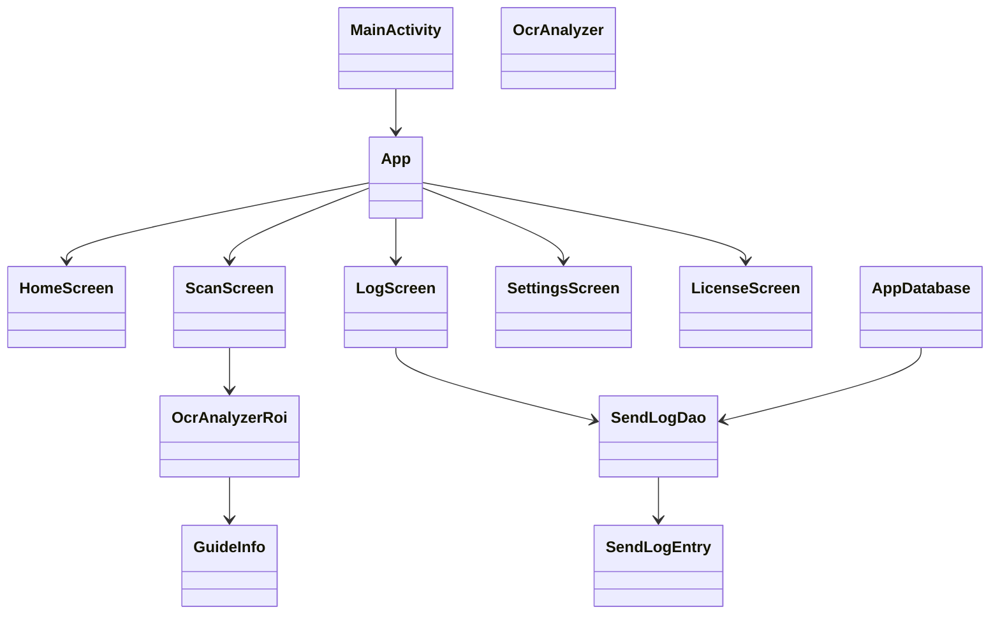
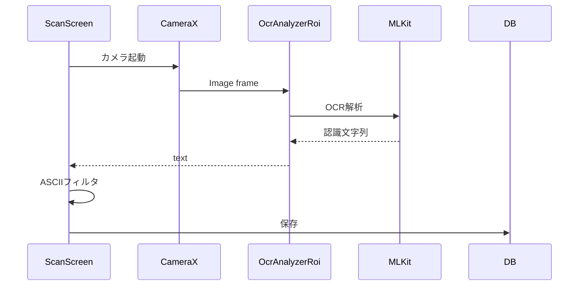

<!-- 表紙 -->
<div class="cover">
  <div class="title">OcrLogTemplate<br>内部設計書（クラス構造）</div>
  <div class="version">v1.0.0</div>
  <div class="date">2026-03-08</div>
  <div class="logo">

   

  </div>
  <div class="copyrights">
    OcrLogTemplate Project
  </div>
</div>

<div class="page-break"></div>

<!-- omit from toc -->
# 目次

- [1. システム概要・目的](#1-システム概要目的)
- [2. パッケージ構成](#2-パッケージ構成)
- [3. クラス構成](#3-クラス構成)
- [4. 主要クラス一覧](#4-主要クラス一覧)
- [5. クラス定義概要](#5-クラス定義概要)
- [6. データ保存構造](#6-データ保存構造)
- [7. OCR処理概要](#7-ocr処理概要)
- [付録 改訂履歴](#付録-改訂履歴)

---

# 1. システム概要・目的

本書は **OcrLogTemplate アプリケーションの内部構造** を整理することを目的とする。

主な内容

- パッケージ構成
- クラス構成
- データ保存構造
- OCR処理フロー

本資料は以下用途を想定する。

- ソースコード理解
- 保守・改修時の参照資料
- サンプルアプリとしての教育用途

---

# 2. パッケージ構成

```text
io.github.monotec.ocrlogger

├─ MainActivity
│
├─ ui
│  ├─ App.kt
│  ├─ HomeScreen.kt
│  ├─ ScanScreen.kt
│  ├─ LogScreen.kt
│  ├─ SettingsScreen.kt
│  └─ LicenseScreen.kt
│
├─ ui.navigation
│  ├─ AppNavHost
│  └─ Screen
│
├─ ocr
│  ├─ OcrAnalyzer
│  ├─ OcrAnalyzerRoi
│  └─ GuideInfo
│
├─ database
│  ├─ SendLogDao
│  └─ AppDatabase
│
├─ model
│  └─ SendLogEntry
│
├─ settings
│  ├─ SettingsRepository
│  └─ SettingsDataStore
│
└─ ui.theme
```

# 3. クラス構成



---

## 4. 主要クラス一覧

| 区分  | クラス名           | 概要               |
| --- | -------------- | ---------------- |
| UI  | MainActivity   | アプリ起動エントリ        |
| UI  | App            | Composeナビゲーション管理 |
| UI  | HomeScreen     | ホーム画面            |
| UI  | ScanScreen     | OCR読取画面          |
| UI  | LogScreen      | 履歴表示画面           |
| UI  | SettingsScreen | 設定画面             |
| UI  | LicenseScreen  | ライセンス表示画面        |
| OCR | OcrAnalyzer    | OCR解析クラス         |
| OCR | OcrAnalyzerRoi | ROI付きOCR解析       |
| OCR | GuideInfo      | OCRガイド枠情報        |
| DB  | SendLogEntry   | 履歴データEntity      |
| DB  | SendLogDao     | 履歴操作DAO          |
| DB  | AppDatabase    | Room DB本体        |

---

## 5. クラス定義概要

### 5.1 OcrAnalyzer

ML Kit OCRを使用してカメラ画像から文字を抽出する。

主な処理

-   CameraX ImageAnalysis
-   ML Kit Text Recognition
-   OCR文字抽出

---

### 5.2 OcrAnalyzerRoi

OCR対象範囲をガイド枠内に限定する解析クラス。

役割

-   OCR対象領域制御
-   認識精度向上
-   ノイズ削減

---

### 5.3 SendLogEntry

OCR結果履歴を保存するRoomエンティティ。

| 項目 | 型 | 内容 |
|------|----|------|
| id | Long | レコードID |
| timestampEpochMillis | Long | 読取日時 |
| text | String | OCR文字 |
| result | String | 処理結果 |

---

# 6. データ保存構造
本アプリでは以下のデータを保存する。

### 6.1 OCR履歴

保存先
```text
Room Database

```

保存テーブル
```text
send_log
```

用途

-   履歴画面表示
-   CSV出力
-   OCR結果記録

---

### 6.2 アプリ設定

保存先
```text
DataStore
```

保存内容

-   OCR読取モード
-   ASCIIモード
-   全文字モード

---

# 7. OCR処理概要


---

# 付録 改訂履歴

|版数|日付|内容|
|---|---|---|
|v1.0.0|2026-03-08|初版|