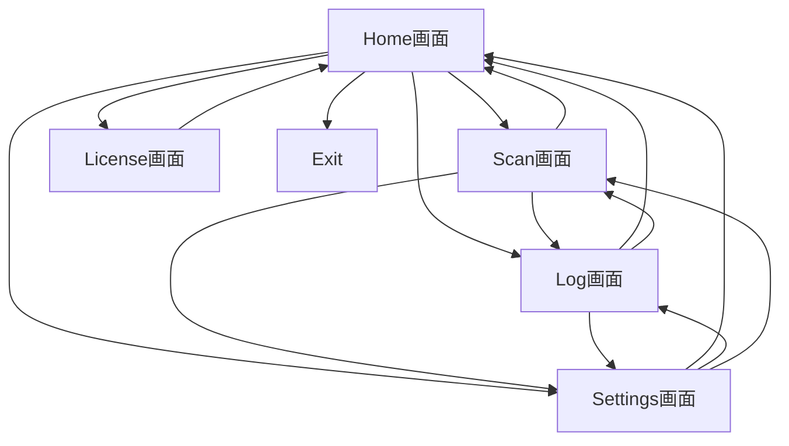

<!-- 表紙 -->

  
OcrLogTemplate 画面遷移図

  
v1.0.0

  
2026-03-08

  

   

  

  
OcrLogTemplate Project

---

<!-- omit from toc -->
# 目次

- [1. 目的](#1-目的)
- [2. 画面一覧](#2-画面一覧)
- [3. 基本画面遷移](#3-基本画面遷移)
- [付録 改訂履歴](#付録-改訂履歴)

---

# 1. 目的

本書は OcrLogTemplate アプリの画面構成および画面遷移を定義する。  
本書は画面遷移図兼外部設計資料として扱う。

---

# 2. 画面一覧

| 画面ID | 画面名 | 概要 |
|--------|--------|------|
| SCR000 | Home画面 | アプリメニュー |
| SCR001 | Scan画面 | OCR読取および保存 |
| SCR002 | Log画面 | OCR履歴表示 |
| SCR003 | Settings画面 | OCR読取モード設定 |
| SCR004 | License画面 | 使用ライブラリ表示 |
| SCR999 | Exit | アプリ終了 |

---

# 3. 基本画面遷移

---

# 付録 改訂履歴

|版数|日付|内容|
|---|---|---|
|v1.0.0|2026-03-08|初版|
